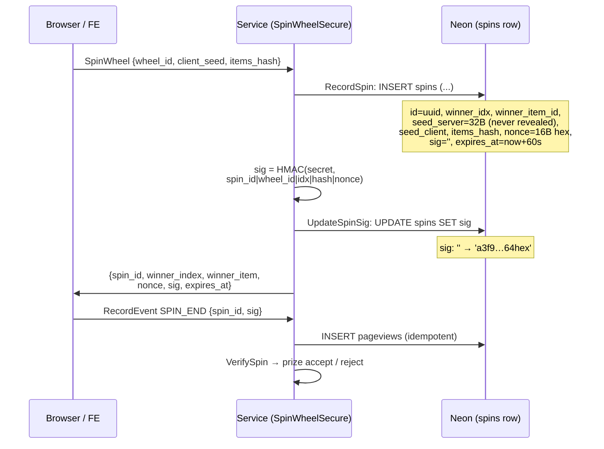
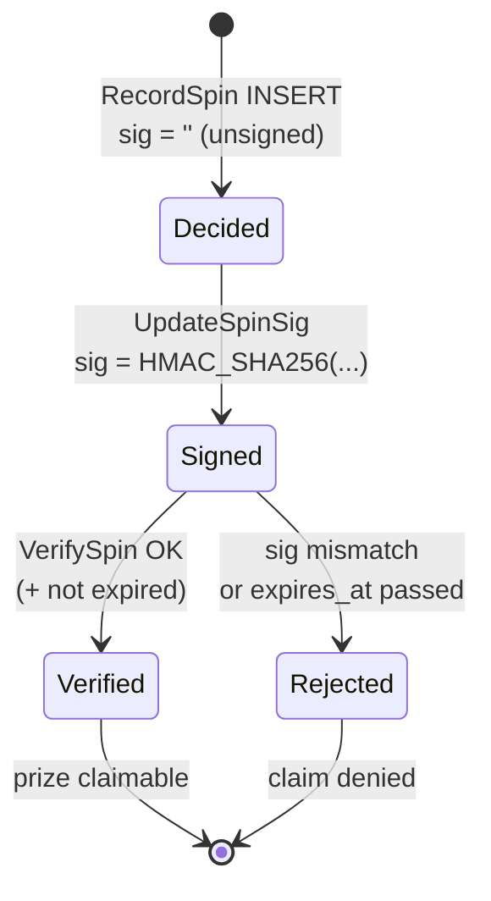
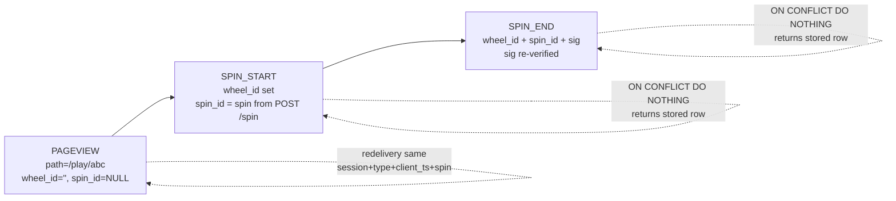

# Spinwheel Backend

This document provides instructions on how to build, start, and test the backend service for the Spinwheel application.

## Overview

The backend is a Go-based application built with Bazel. It uses a clean, 3-layer architecture (Handler -> Service -> Repository) and supports both gRPC and REST protocols.

- **gRPC Server:** Port `50051`
- **REST Gateway:** Port `8080`

## Development Environment Setup

The backend is built and managed using [Bazel](https://bazel.build/).

### Install Bazel

```bash
sudo apt-get update && sudo apt-get install -y curl gnupg
curl https://bazel.build/bazel-release.pub.gpg | sudo apt-key add -
echo "deb [arch=amd64] https://storage.googleapis.com/bazel-apt stable jdk1.8" | sudo tee /etc/apt/sources.list.d/bazel.list
sudo apt-get update && sudo apt-get install -y bazel
```

## Building, Testing, and Running

**Build all targets:**
```bash
bazel build //...
```

**Run the backend server:**
```bash
bazel run //backend/cmd/server:server
```

**Run all tests:**
```bash
bazel test //...
```

## Postgres (Neon) — SPI-7

Decision locked 2026-09-12: Neon Free (permanent, no card) + Cloud Run. Project region `us-east-2` (match Cloud Run `us-east1`).

- Free caps: `0.5GB/project, 100 CU-h/project/mo, scale-to-zero after 5min, 5GB egress`. Validated for ~1000 DAU (~150k req/mo).
- Connection strings (Neon console > Project Dashboard > `Connect`): pooling **ON** (`-pooler` hostname) → app `DATABASE_URL` (PgBouncer); pooling **OFF** → `DIRECT_URL` for migrations/`psql`.
- Compute: `0.25CU min / 2CU max`, scale-to-zero ON (Free locks it to 5min).

**Env (never commit secrets):**
```bash
export DATABASE_URL="postgresql://...-pooler.c-2.us-east-2.aws.neon.tech/neondb?sslmode=require&channel_binding=require"
export DIRECT_URL="postgresql://....c-2.us-east-2.aws.neon.tech/neondb?sslmode=require&channel_binding=require"
```

**Migrate tool (needs the `postgres` build tag or it errors `unknown driver postgresql`):**
```bash
go install -tags 'postgres' github.com/golang-migrate/migrate/v4/cmd/migrate@v4.18.1
migrate -database "$DIRECT_URL" -path ./migrations up
psql "$DIRECT_URL" -c "\dt"
```
If lib/pq rejects `channel_binding`, retry with `&channel_binding=require` stripped (app keeps it; only `migrate` drops it).

**Schema (`migrations/000001_wheels`):** `wheels(id UUID PK, name, config JSONB)`, `wheel_items(wheel_id FK CASCADE, option, color, weight>0)`, `spins(wheel_id FK, winner_idx, winner_item_id SET NULL, seed_server BYTEA, seed_client, items_hash, nonce, sig, session_id, ip_hash, ua, cf_ray, expires_at)`, `pageviews` (= RecordEvent store: `session_id, type PAGEVIEW|SPIN_START|SPIN_END, wheel_id, spin_id, path, sig, client_ts` + `UNIQUE(session_id, type, client_ts, spin_id)` idempotency).

**Ops notes:** prune `spins/pageviews >90d` (else 0.5GB fills and writes fail); `HMAC_SECRET` via env; `go.mod` stays clean — add `pgx/v5` + `google/uuid` deliberately with `postgres.go`, not via throwaway `go get`.

## Spin + event flows (SPI-7 steps 1-2)

GitHub renders the Mermaid blocks below as diagram images.

### Secure spin — who writes what, and how the `spins` row changes state



### `spins` row lifecycle (state diagram)



### Field transitions per stage

| Stage | `sig` | `seed_server` | `nonce` | `winner_idx` / `winner_item_id` | `expires_at` |
|---|---|---|---|---|---|
| `RecordSpin` INSERT | `''` (unsigned) | 32B `crypto/rand`, never leaves server | 16B hex, unique per spin | decided by weighted draw, locked via `SELECT … FOR UPDATE` | `now + 60s` |
| `UpdateSpinSig` | `''` → `HMAC(secret, spin_id\|wheel_id\|idx\|hash\|nonce)` | unchanged | unchanged | unchanged | unchanged |
| `SpinWheelResponse` → FE | echoed (opaque to FE) | never sent | echoed (makes sig unique on repeat winners) | `winner_index` drives animation; full item avoids refetch | FE checks clock |
| `RecordEvent` SPIN_END | echoed back, re-verified | — | echoed | joined via `spin_id` | server enforces (kills replays) |
| Item edited/deleted later | stays verifiable (`items_hash` pins the list the spin was drawn from) | unchanged | unchanged | `winner_item_id → NULL` (`ON DELETE SET NULL`); `winner_idx` preserved | unchanged |

### Analytics funnel — `pageviews` rows (one row per event, idempotent)



Idempotency key: `(session_id, type, client_ts, spin_id)` — `UNIQUE pageviews_idempotency_uniq`. `ua / cf_ray / ip_hash` are server-filled from HTTP context, never trusted from the client body.

## Testing the API

The backend provides a gRPC API. You can test it using `grpcurl`:

**List available services:**
```bash
grpcurl -plaintext localhost:50051 list
```

**Create a wheel:**
```bash
grpcurl -plaintext -H "x-user-id: test-user" \
  -d '{"name": "Test Wheel", "initial_items": ["Option 1", "Option 2", "Option 3"]}' \
  localhost:50051 spinwheel.v1.WheelService/CreateWheel
```

**Note:** The `x-user-id` header is required by the UserIDInterceptor middleware for local development.

## Code Structure

- `cmd/server/main.go`: Entry point for the backend server.
- `internal/handler`: gRPC handlers processing incoming requests.
- `internal/service`: Core business logic.
- `internal/repository`: Data access layer (`InMemoryWheelRepository` for tests/dev; `PostgresWheelRepository` on Neon + `migrations/`, SPI-7 step 1 done).
- `pkg/models`: Core data structures.
- `gen/proto`: Generated Go code from `.proto` files.

## Frontend (Reference)

The frontend is a lightweight **Preact** application located in the `/frontend` directory. It uses a custom Canvas-based wheel implementation for high performance and minimal dependencies.

## Security Considerations

- **Development:** Never commit `.env` files. The `X-User-Id` header is for local testing only.
- **Production:** Replace `X-User-Id` with JWT authentication, enable HTTPS, and use environment variables for sensitive data.
- **Rate Limiting:** Default is set to 100 req/min per user.
