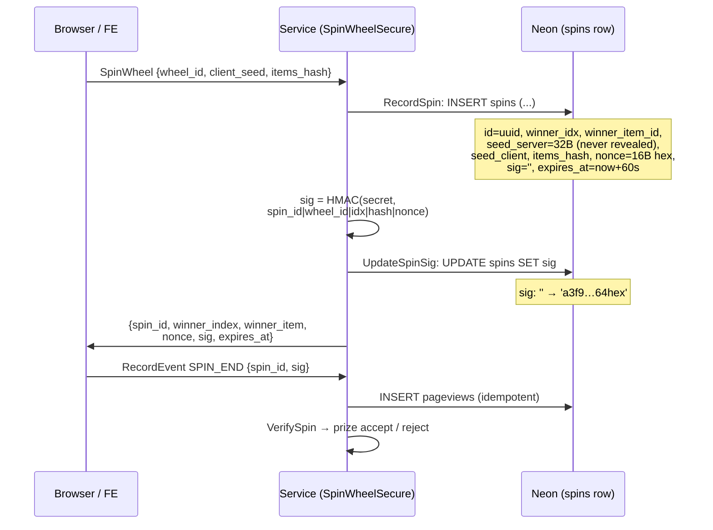
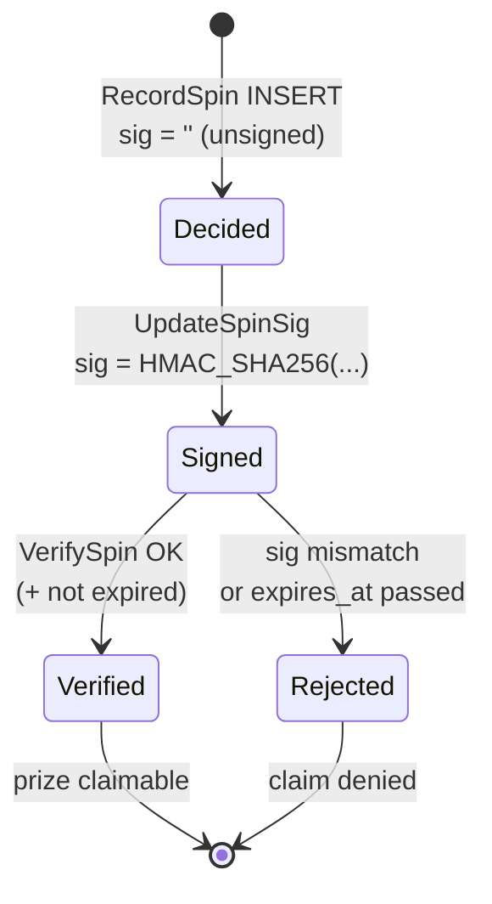
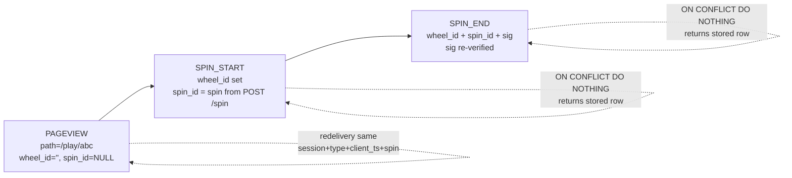
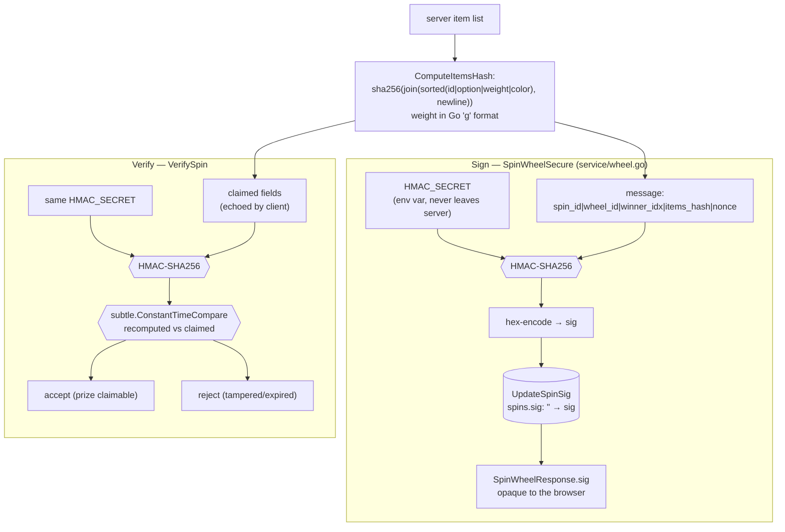

# Spinwheel Backend

This document provides instructions on how to build, start, and test the backend service for the Spinwheel application.

## Overview

The backend is a Go-based application built with Bazel. It uses a clean, 3-layer architecture (Handler -> Service -> Repository) and supports both gRPC and REST protocols.

- **gRPC Server:** Port `50051`
- **REST Gateway:** Port `8080`

## Development Environment Setup

The backend is built and managed using [Bazel](https://bazel.build/).

### Install Bazel

```bash
sudo apt-get update && sudo apt-get install -y curl gnupg
curl https://bazel.build/bazel-release.pub.gpg | sudo apt-key add -
echo "deb [arch=amd64] https://storage.googleapis.com/bazel-apt stable jdk1.8" | sudo tee /etc/apt/sources.list.d/bazel.list
sudo apt-get update && sudo apt-get install -y bazel
```

## Building, Testing, and Running

**Build all targets:**
```bash
bazel build //...
```

**Run the backend server:**
```bash
bazel run //backend/cmd/server:server
```

**Run all tests:**
```bash
bazel test //...
```

## Postgres (Neon) — SPI-7

Decision locked 2026-09-12: Neon Free (permanent, no card) + Cloud Run. Project region `us-east-2` (match Cloud Run `us-east1`).

- Free caps: `0.5GB/project, 100 CU-h/project/mo, scale-to-zero after 5min, 5GB egress`. Validated for ~1000 DAU (~150k req/mo).
- Connection strings (Neon console > Project Dashboard > `Connect`): pooling **ON** (`-pooler` hostname) → app `DATABASE_URL` (PgBouncer); pooling **OFF** → `DIRECT_URL` for migrations/`psql`.
- Compute: `0.25CU min / 2CU max`, scale-to-zero ON (Free locks it to 5min).

**Env (never commit secrets):**
```bash
export DATABASE_URL="postgresql://...-pooler.c-2.us-east-2.aws.neon.tech/neondb?sslmode=require&channel_binding=require"
export DIRECT_URL="postgresql://....c-2.us-east-2.aws.neon.tech/neondb?sslmode=require&channel_binding=require"
```

**Migrate tool (needs the `postgres` build tag or it errors `unknown driver postgresql`):**
```bash
go install -tags 'postgres' github.com/golang-migrate/migrate/v4/cmd/migrate@v4.18.1
migrate -database "$DIRECT_URL" -path ./migrations up
psql "$DIRECT_URL" -c "\dt"
```
If lib/pq rejects `channel_binding`, retry with `&channel_binding=require` stripped (app keeps it; only `migrate` drops it).

**Schema (`migrations/000001_wheels`):** `wheels(id UUID PK, name, config JSONB)`, `wheel_items(wheel_id FK CASCADE, option, color, weight>0)`, `spins(wheel_id FK, winner_idx, winner_item_id SET NULL, seed_server BYTEA, seed_client, items_hash, nonce, sig, session_id, ip_hash, ua, cf_ray, expires_at)`, `pageviews` (= RecordEvent store: `session_id, type PAGEVIEW|SPIN_START|SPIN_END, wheel_id, spin_id, path, sig, client_ts` + `UNIQUE(session_id, type, client_ts, spin_id)` idempotency).

**Ops notes:** prune `spins/pageviews >90d` (else 0.5GB fills and writes fail); `HMAC_SECRET` via env; `go.mod` stays clean — add `pgx/v5` + `google/uuid` deliberately with `postgres.go`, not via throwaway `go get`.

## Spin + event flows (SPI-7 steps 1-2)

GitHub renders the Mermaid blocks below as diagram images.

### Secure spin — who writes what, and how the `spins` row changes state



### `spins` row lifecycle (state diagram)



### Field transitions per stage

| Stage | `sig` | `seed_server` | `nonce` | `winner_idx` / `winner_item_id` | `expires_at` |
|---|---|---|---|---|---|
| `RecordSpin` INSERT | `''` (unsigned) | 32B `crypto/rand`, never leaves server | 16B hex, unique per spin | decided by weighted draw, locked via `SELECT … FOR UPDATE` | `now + 60s` |
| `UpdateSpinSig` | `''` → `HMAC(secret, spin_id\|wheel_id\|idx\|hash\|nonce)` | unchanged | unchanged | unchanged | unchanged |
| `SpinWheelResponse` → FE | echoed (opaque to FE) | never sent | echoed (makes sig unique on repeat winners) | `winner_index` drives animation; full item avoids refetch | FE checks clock |
| `RecordEvent` SPIN_END | echoed back, re-verified | — | echoed | joined via `spin_id` | server enforces (kills replays) |
| Item edited/deleted later | stays verifiable (`items_hash` pins the list the spin was drawn from) | unchanged | unchanged | `winner_item_id → NULL` (`ON DELETE SET NULL`); `winner_idx` preserved | unchanged |

### Analytics funnel — `pageviews` rows (one row per event, idempotent)



Idempotency key: `(session_id, type, client_ts, spin_id)` — `UNIQUE pageviews_idempotency_uniq`. `ua / cf_ray / ip_hash` are server-filled from HTTP context, never trusted from the client body.

### HMAC — how `sig` is built and checked



Why each input is in the message:

- `spin_id` binds the signature to one audit row (and doubles as the idempotency/join key).
- `winner_idx` (not the option string) — options may duplicate (`"Try again"` × 2).
- `items_hash` pins the exact list drawn from: a stale or forged client list fails the pre-check (`FailedPrecondition(wheel_changed)`) and could never verify anyway.
- `nonce` (16B hex, fresh per spin) makes the sig unique even for repeat winners.
- The secret never leaves the server, so `sig` is opaque to the FE; constant-time compare defeats timing oracles; empty secret fails closed; `expires_at` (+60s) bounds replay — HMAC alone does not expire.
- Why HMAC and not RSA: one env var, no key management (per contract); upgrade to Ed25519 only if offline FE verification is ever needed.

Covered by `TestVerifySpinRejectsTampering`: flipped index, swapped hash/nonce, forged and case-mutated sig, wrong secret — all rejected.

#### Worked example (dummy values — never the real secret)

Items (server-canonical order irrelevant — lines are sorted before hashing):

```text
aaaaaaaa-aaaa-aaaa-aaaa-aaaaaaaaaaaa|Red|3|#ff0000
bbbbbbbb-bbbb-bbbb-bbbb-bbbbbbbbbbbb|Blue|1|#0000ff
```

```text
items_hash = sha256(lines joined with "\n")
           = 01bed39318807f419b9dde6fd8c14fb66eade2a0bd46a6de66acc663e687e17a

message = 22222222-2222-2222-2222-222222222222|11111111-1111-1111-1111-111111111111|1|01bed393…e687e17a|0123456789abcdef0123456789abcdef
            (spin_id                            |wheel_id                            |idx|items_hash      |nonce)

sig = hex(HMAC_SHA256("dummy-secret-NOT-PRODUCTION", message))
    = 63998db7c8ce8fcf01773dadb3ebc3b0e251f82fddf0d5fe374a03eda6053ab3
```

Reproduce it (mirrors `signSpin` exactly):

```bash
python3 -c "import hashlib,hmac; print(hmac.new(b'dummy-secret-NOT-PRODUCTION', b'<message>', hashlib.sha256).hexdigest())"
```

Flip any single character of the message (or use another secret) and the hex changes completely — that is what `VerifySpin` checks.

### Spin fields, explained (beginner's glossary)

This is what the service passes to `repo.RecordSpin` (`service/wheel.go` → `SpinParams`), and where each value lands in the `spins` row. **Source** tells you who produces it: browser (untrusted — the server re-checks it) or server/gateway (trusted).

| Field | Plain-English meaning | Source |
|---|---|---|
| `WheelID` | Which wheel was spun (UUID). Foreign key into `wheels`. | browser request → validated against DB |
| `SeedClient` (`client_seed`) | Random string the browser generates (16 bytes hex). Client entropy — combined with the server's secret seed it proves the server didn't pre-pick winners. | browser (`crypto.getRandomValues()`) |
| `ItemsHash` (`items_hash`) | Fingerprint of the exact item list the player saw. Server recomputes from DB; mismatch → spin rejected. | browser → verified by server |
| `SessionID` | Anonymous visitor ID (the `sw_sid` cookie, a UUID). Links `PAGEVIEW → SPIN_START → SPIN_END` with no login. | server (cookie); `x-user-id` fallback on gRPC |
| `IPHash` | One-way hash of the player's IP — abuse analysis without storing personal data (hashes can't be reversed). | server (HTTP gateway, step 4) |
| `UA` | Browser/device string (`User-Agent`). Used for analytics + debugging. | server (request header) |
| `CFRay` | Cloudflare's per-request ID. Lets support trace one exact request across logs. | server (`CF-Ray` header) |
| `SeedServer` | 32 secret random bytes generated per spin. Never leaves the server. | server (`crypto/rand`, repo layer) |
| `Nonce` | 16 fresh random bytes (hex) per spin. Makes each `sig` unique. | server (repo layer) |
| `Sig` | The HMAC signature (see above). `''` at INSERT, set right after. | server (service layer) |

Three things to remember:

1. **Two trust levels.** `SeedClient`/`ItemsHash` come from the player and are re-verified; `SessionID`/`IPHash`/`UA`/`CFRay` are filled by the server and never trusted from the client body.
2. **Some fields are signed.** `WheelID` and `ItemsHash` (with spin ID, winner index, nonce) go into the HMAC — tampering with any of them invalidates `sig`.
3. **Anon-first privacy.** No names, emails, or raw IPs anywhere: random session IDs plus an irreversible IP hash.

## HTTP API (SPI-7 step 4)

HTTP is the **only public API**. The gRPC service still exists in code
(`internal/handler`) but is not served — exposing it is backlog for later.
Everything a browser needs is three routes (package `internal/http`,
stdlib-only, no framework):

| Method | Path | Success | Notes |
| ------ | ---- | ------- | ----- |
| `GET` | `/healthz` | `200 {"status":"ok"}` | Cloud Run health checks. |
| `POST` | `/v1/wheels/{id}/spin` | `200` spin JSON (below) | Body `{client_seed, items_hash}`. |
| `POST` | `/v1/events` | `204` empty | Body `{type, wheel_id?, spin_id?, path?, sig?, session_id?, client_ts?}`. |

```bash
# Health
curl localhost:8080/healthz

# Spin (items_hash comes from GET wheel data — the server rejects
# empty/stale hashes with 400 wheel_changed so the FE refreshes first)
curl -c jar -X POST localhost:8080/v1/wheels/$WHEEL_ID/spin \
  -H 'Content-Type: application/json' \
  -d '{"client_seed":"abc","items_hash":"<hash>"}'
# -> {"spin_id":"…","winner_index":1,"winner_item":{…},"nonce":"…","sig":"…","expires_at":"…"}
# The -c jar stores the sw_sid session cookie for subsequent calls.

# Analytics event
curl -b jar -X POST localhost:8080/v1/events \
  -H 'Content-Type: application/json' \
  -d '{"type":"PAGEVIEW","path":"/play/abc"}'
# -> 204, empty body (redelivery is a no-op, not an error)
```

### Sessions (`sw_sid` cookie)

Anon identity, resolved per request: a **valid cookie wins**, then an
explicit `session_id` in the JSON body (adopted + set as cookie), else a
fresh UUIDv7. Attributes: `HttpOnly`, `Path=/`, `SameSite=Lax`, 1 year,
`Secure` in production. Malformed cookies are treated as absent (a bad
cookie can never wedge a client) and valid cookies are never rotated.

> Cross-site caveat: FE (Cloudflare Pages) × API (Cloud Run) are different
> origins, so browsers will **not** send a `Lax` cookie on cross-site
> `fetch`. Continuity then relies on the FE echoing `session_id` in request
> bodies (or a first-party API hostname — decision open in SPI-8).

### Errors

JSON body `{"error":"…"}` with a status:

| Status | Meaning |
| ------ | ------- |
| `400` | Bad JSON, bad `wheel_id`/`spin_id`/`client_ts`, missing event type, or `wheel_changed` (empty/stale `items_hash` — refresh the wheel and retry). |
| `404` | Unknown wheel / unknown route. |
| `405` | Wrong method. |
| `413` | Body over 1MB. |
| `429` | Over the rate limit — carries `Retry-After: 60`. |
| `500` | Internal error (logged server-side with `cf_ray`). |

### Limits, CORS, attribution

- **Rate limit:** 100 req/min per `IP + session` (configurable, disabled
  with `<= 0`). In-memory per instance — the effective limit scales with
  instance count (fine at max 3).
- **CORS:** allowlist only (`CORS_ORIGINS`). Allowed origins get an
  explicit echo + `Allow-Credentials: true` (the cookie is credentialed);
  anything else gets no CORS headers. Preflights (`OPTIONS`) return 204
  before rate limiting and logging.
- **Attribution:** spins/events store `ip_hash` (SHA-256 — raw IPs are
  never persisted), `Cf-Ray`, and UA. Access logs carry
  method/path/status/latency + `ip_hash`/`ua`/`cf_ray`; spins add a
  `spin_id`/`cf_ray` line. Client IP trusts `CF-Connecting-IP`, then the
  leftmost `X-Forwarded-For`, then the connection address.
- **Bodies** are capped at 1MB (`http.MaxBytesReader` + `ContentLength`
  fast-path).

## Testing the API

The public API is HTTP — see [HTTP API](#http-api-spi-7-step-4) above for
`curl` examples (`/healthz`, spin, events).

### Production smoke test (post-deploy runbook, SPI-7 step 6)

Copy-paste against any deployment by setting `API` (no trailing slash).
Every check below was verified green against Cloud Run on 2026-09-13.

```bash
API=https://spinwheel-raaxoahc7a-ue.a.run.app

# 1. Health
curl -sS -w '\nhealthz: %{http_code}\n' "$API/healthz"   # -> 200 {"status":"ok"}

# 2. Create a wheel (201; proves DATABASE_URL + Neon wiring)
curl -sS "$API/v1/wheels" -H 'Content-Type: application/json' -d '{
  "name": "prod-seed",
  "items": [
    {"option": "A", "color": "#ff0000", "weight": 1},
    {"option": "B", "color": "#00ff00", "weight": 1}
  ]}' | tee /tmp/wheel.json

# 3. Compute items_hash exactly per contract v1:
#    sha256 of newline-joined sorted "id|option|weight|color" lines,
#    weight in %g format (must match ComputeItemsHash — FE serializes identically)
WHEEL_ID=$(python3 -c "import json; print(json.load(open('/tmp/wheel.json'))['id'])")
ITEMS_HASH=$(python3 -c "
import json, hashlib
w = json.load(open('/tmp/wheel.json'))
lines = sorted(f\"{i['id']}|{i['option']}|{float(i['weight']):g}|{i['color']}\" for i in w['items'])
print(hashlib.sha256('\n'.join(lines).encode()).hexdigest())")

# 4. Signed spin (200 spin_id/winner_index/nonce/sig/expires_at)
curl -sS "$API/v1/wheels/$WHEEL_ID/spin" -H 'Content-Type: application/json' \
  -d "{\"client_seed\": \"smoke-1\", \"items_hash\": \"$ITEMS_HASH\"}" | tee /tmp/spin.json

# 5. Verify sig offline (constant-time compare; secret stays out of output).
#    Local dev: HMAC_SECRET comes from /tmp/spin.env.
#    Prod check: replace the source line with
#      SECRET=$(gcloud secrets versions access latest --secret=HMAC_SECRET) && export HMAC_SECRET="$SECRET"
source /tmp/spin.env   # exports HMAC_SECRET; no-op if already set
SPIN_ID=$(python3 -c "import json; print(json.load(open('/tmp/spin.json'))['spin_id'])")
IDX=$(python3 -c "import json; print(json.load(open('/tmp/spin.json'))['winner_index'])")
NONCE=$(python3 -c "import json; print(json.load(open('/tmp/spin.json'))['nonce'])")
SIG=$(python3 -c "import json; print(json.load(open('/tmp/spin.json'))['sig'])")
python3 -c "
import hmac, hashlib
import os
secret = os.environ['HMAC_SECRET']
msg = f'$SPIN_ID|$WHEEL_ID|$IDX|$ITEMS_HASH|$NONCE'.encode()
print('SIG:', 'OK' if hmac.compare_digest(
    hmac.new(secret.encode(), msg, hashlib.sha256).hexdigest(), '$SIG') else 'FAIL')"
# Also assert expires_at is ~60s in the future.

# 6. Analytics event (204, empty body; redelivery is a no-op)
curl -sS -o /dev/null -w 'events: %{http_code}\n' "$API/v1/events" \
  -H 'Content-Type: application/json' \
  -d "{\"type\": \"PAGEVIEW\", \"path\": \"/\", \"wheel_id\": \"$WHEEL_ID\"}"

# 7. Stale items_hash must fail closed (400 wheel_changed, nothing persisted)
curl -sS -w '\ncode: %{http_code}\n' "$API/v1/wheels/$WHEEL_ID/spin" \
  -H 'Content-Type: application/json' -d '{"client_seed": "x", "items_hash": "deadbeef"}'

# 8. CORS preflight echoes the configured origin (see CORS_ORIGINS)
curl -sS -o /dev/null -D - -X OPTIONS "$API/v1/events" \
  -H 'Origin: https://spinwheels.fun' -H 'Access-Control-Request-Method: POST' \
  | grep -i access-control-allow-origin

# 9. Rows landed (DIRECT_URL only; never the pooled URL for psql/migrate)
psql "$DIRECT_URL" -c \
  "SELECT (SELECT count(*) FROM spins) AS spins, (SELECT count(*) FROM pageviews) AS pageviews;"
```

Known Cloud Run quirks (observed 2026-09-13, not blockers):

- `gcloud run deploy` prints a stale-format URL
  (`spinwheel-<project-number>.us-east1.run.app`); the canonical URL is the
  `*.a.run.app` one from `gcloud run services describe`. Both route.
- `GET /healthz` is shadowed at Google edge (HTML 404, never reaches the
  container, absent from request logs) while every other path routes fine.
  Prove liveness via the app routes above, not `/healthz`.
- First `--source` deploy fails on IAM: the Compute default SA needs
  `roles/cloudbuild.builds.builder`, `roles/storage.admin`, and
  `roles/artifactregistry.writer` before Cloud Build can run.

The gRPC service is internal/backlog (not served). If you re-enable it
locally, `grpcurl` works without any auth headers — `x-user-id` is now
optional (anon-first) and only acts as a grpcurl/test fallback:

**List available services:**
```bash
grpcurl -plaintext localhost:50051 list
```

**Create a wheel:**
```bash
grpcurl -plaintext \
  -d '{"name": "Test Wheel", "initial_items": ["Option 1", "Option 2", "Option 3"]}' \
  localhost:50051 spinwheel.v1.WheelService/CreateWheel
```

## Code Structure

- `cmd/server/main.go`: Entry point for the backend server (HTTP-only; gRPC serving is backlog).
- `internal/http`: Public JSON gateway (`/healthz`, spin, events) + `sw_sid` sessions, CORS, rate limiting, request logging.
- `internal/handler`: gRPC handlers (built and unit-tested, but not currently served).
- `internal/middleware`: Optional `x-user-id` attach + exported IP+session rate `Limiter`.
- `internal/service`: Core business logic.
- `internal/repository`: Data access layer (`InMemoryWheelRepository` for tests/dev; `PostgresWheelRepository` on Neon + `migrations/`, SPI-7 step 1 done).
- `pkg/models`: Core data structures.
- `gen/proto`: Generated Go code from `.proto` files.

## Frontend (Reference)

The frontend is a lightweight **Preact** application located in the `/frontend` directory. It uses a custom Canvas-based wheel implementation for high performance and minimal dependencies.

## Security Considerations

- **Development:** Never commit `.env` files. `X-User-Id` is an optional local-testing fallback, never a credential.
- **Production:** Enable HTTPS, and use environment variables for sensitive data (`HMAC_SECRET`, `DATABASE_URL`).
- **Rate Limiting:** Default is 100 req/min per IP+session (see HTTP API).
